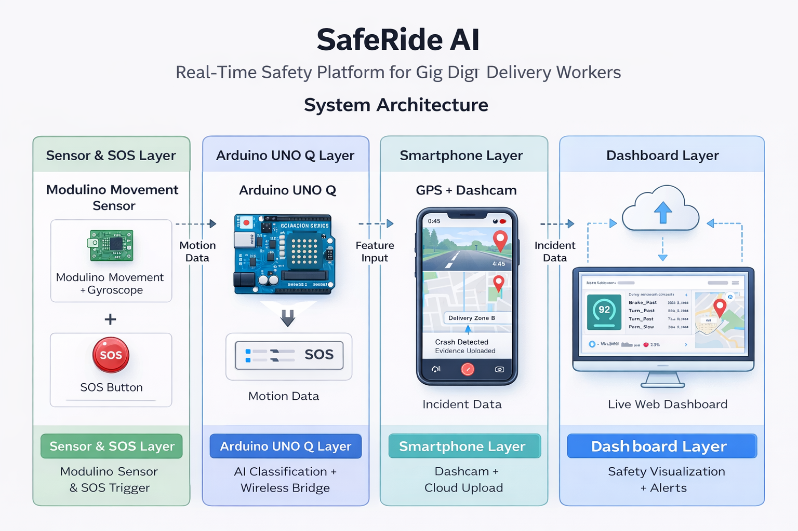
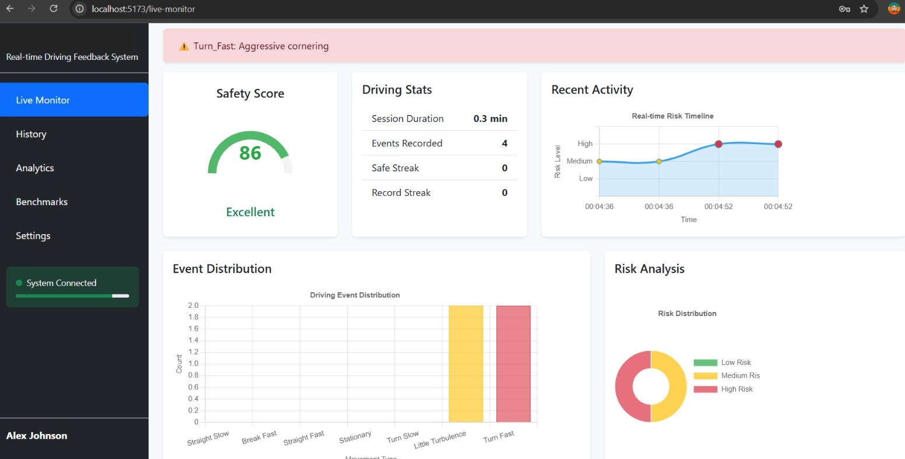
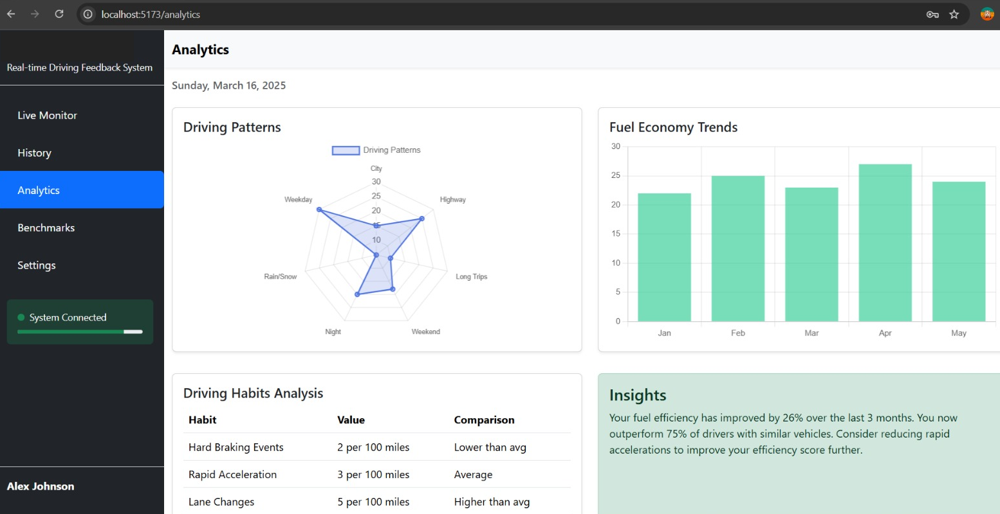
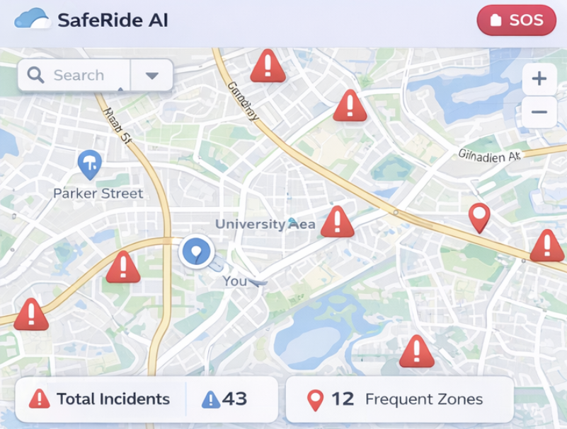

# [AfA2026-PhysicalAI] SafeRide AI – Gig Worker Safety Platform

SafeRide AI is an AI-powered embedded safety system for two-wheeler gig delivery workers, built on **Arduino UNO Q** with **Arduino App Lab**. The system performs real-time driving pattern classification, accident detection, SOS emergency response, and smartphone-based dashcam evidence logging—supporting safer mobility for millions of vulnerable workers.

---

## 🚨 The Crisis

India’s **5 million gig delivery workers** face:

- 🚑 **400+ deaths** annually (Mumbai alone)  
- 🔪 Thousands of robbery incidents in unsafe zones  
- 💸 High insurance claim rejection rates due to missing evidence  
- 🏍️ Frequent bike theft during deliveries  

**One incident can cost months of income and long-term financial instability.**

---

## 💡 Solution Overview

SafeRide AI combines:

- **Motion sensing** on Arduino UNO Q (Modulino Movement sensor)  
- **AI-based driving behavior classification** (Decision Tree model)  
- **Smartphone dashcam + GPS integration** (evidence pipeline)  
- **SOS emergency response** (one-button panic alert)  
- **Live dashboard visualization** (real-time safety metrics)  

**Key Innovation:** A phone-first architecture leverages riders’ existing smartphones instead of expensive proprietary hardware.

---

## ✅ Implementation Summary

### 1. Project Description  
SafeRide AI is a real-time rider safety system that integrates embedded sensors with lightweight AI to classify risky driving patterns, detect crashes, trigger SOS emergencies, and log incident evidence. The platform is designed for gig delivery workers who operate without formal insurance protection, enabling safer rides and stronger financial inclusion.

---

### 2. Hardware Lineup  

- **Arduino UNO Q**  
  Dual-core board running sensor acquisition (MCU) and AI + dashboard hosting (Python processor).

- **Modulino Movement Sensor (Accelerometer + Gyroscope)**  
  Captures inertial motion data for driving classification and crash detection.

- **SOS Emergency Button**  
  Physical panic trigger for robbery or emergency situations.

- **Smartphone Integration (Dashcam + GPS)**  
  Provides continuous video evidence, live GPS tagging, and instant upload support.

- *(Optional)* USB peripherals (hub/webcam/SD) for extended standalone operation.

---

### 3. User Interface & Feedback  

SafeRide provides rider-facing feedback through:

- **Built-in Web Dashboard**  
  Displays driving pattern labels, safety score (0–100), event timeline, SOS alerts, and danger zones.

- **Event Timeline & Incident Logging**  
  Tracks harsh braking, sharp turns, turbulence zones, crashes, and emergency triggers.

- **Expandable Physical Alerts**  
  Supports LED/buzzer hooks for immediate real-time rider warnings.

---

### Crash & Harsh Event Detection  

CRASH DETECTED → Dashcam evidence saved → GPS logged → Alerts triggered → Dashboard updated

---

### SOS Emergency Mode  

One-button SOS triggers emergency logging, evidence capture, and danger-zone tagging.

---

### Phone-First Dashcam Evidence Pipeline  

Smartphone provides dashcam + GPS + instant upload for insurance-valid proof.

---

### Live Safety Dashboard  

Real-time interface showing safety score, incidents, and crowdsourced danger maps.

---

### 4. The AI Model  

SafeRide uses a lightweight **Decision Tree classifier** optimized for embedded deployment. It classifies 7 riding patterns at **62.5Hz** using accelerometer + gyroscope data:

| Pattern | Description | Safety Impact |
|--------|------------|--------------|
| Straight_Slow | Normal riding | Safe (+1) |
| Straight_Fast | High speed | Neutral (0) |
| Turn_Slow | Controlled turn | Safe (+1) |
| Turn_Fast | Aggressive turn | Risk (-3) |
| Brake_Fast | Harsh braking | Danger (-5) |
| Little_Turbulence | Road bumps | Logged |
| Stationary | Parked | Theft detection ON |

The model runs locally with low latency (<5ms), enabling instant safety responses without requiring cloud inference. Thresholds are calibrated through inertial feature pipelines for explainable insurance-valid classification.

---

### 5. Software Architecture  

SafeRide leverages the Arduino UNO Q dual-core architecture:

- **MCU Core (C++)**  
  Handles real-time accelerometer/gyroscope sampling and SOS button monitoring.

- **Processor Core (Python – Arduino App Lab)**  
  Performs feature extraction, Decision Tree inference, safety scoring, and dashboard hosting.

- **RPC Bridge Communication**  
  Enables bidirectional messaging between hardware triggers and AI response logic.

- **Web Dashboard Layer**  
  Provides live APIs and WebSocket updates for real-time rider monitoring and danger zone visualization.

---

## 🎥 Visuals & Media  

### Demo Video (2 min) : [LINK](https://drive.google.com/file/d/1-iFlsQWMyJ-xewqoKgR4exkIk_fIQAvc/view)

---

**LIVE MONITORING VIEW**  

**SAFETY SCORE & ANALYTICS**  

**CROWDSOURCED DANGER MAP**  

---

## 📋 PROJECT SUBMISSION

- **GitHub Repository:** [LINK](https://github.com/hrsh-kr/AfA2026-PhysicalAI-SafeRide_AI)  
- **Demo Video (2 min):** [LINK](https://drive.google.com/file/d/1-iFlsQWMyJ-xewqoKgR4exkIk_fIQAvc/view)

---

## 📄 License

**MIT License** – Open innovation for gig worker safety and inclusion.

---

**Built with ❤️ for gig worker safety**

